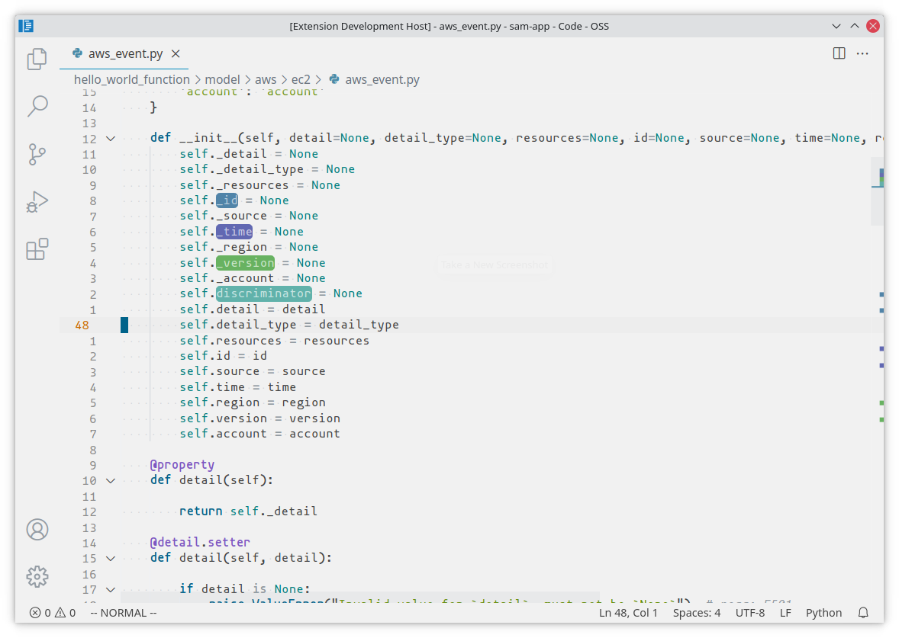

# Crayons

   

Highlight text with crayons

## Installing 

Extension is available in [Visual Studio Code Marketplace](https://marketplace.visualstudio.com/items/vallyscode.crayons)

**Enjoy!**

## License

See [LICENSE](LICENSE)

